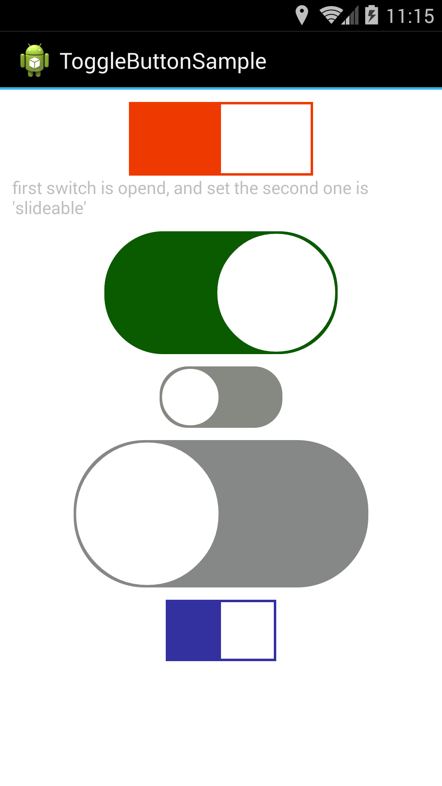

ToggleButton
=========



### How to use

#### layout: 
```xml
<com.button.demo.togglebutton.ToggleButton
        android:id="@+id/swit"
        android:layout_width="150dip"
        android:layout_height="60dip"
        slideswitch:isOpen="true"
        slideswitch:shape="rect"
        slideswitch:themeColor="#ffee3a00" />
```
